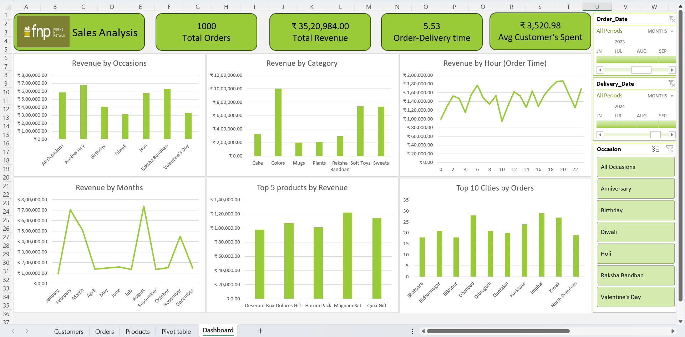

# 📊 FNP Sales Analysis — Excel Dashboard

## 📌 Project Overview

This project presents an **interactive FNP (Ferns N Petals) Sales Analysis Dashboard** developed in Microsoft Excel. The dashboard transforms raw transactional data into meaningful business insights related to **sales performance, revenue, products, occasions, customers, order timing, and geographic demand**.

The analysis helps understand the key factors driving FNP's sales performance and provides actionable insights that can support **marketing, product planning, customer targeting, and business decision-making**.

---

## 🎯 Project Objectives

* Analyze overall sales and revenue performance
* Identify high-performing product categories
* Analyze revenue across different occasions
* Identify top-performing products
* Analyze monthly sales trends
* Understand order patterns by hour
* Identify cities generating the highest number of orders
* Evaluate average customer spending
* Analyze order-to-delivery performance
* Identify key business opportunities from sales data

---

## 📈 Key Performance Indicators

| KPI                            |      Value |
| ------------------------------ | ---------: |
| 💰 Total Revenue               | ₹35,20,984 |
| 🛒 Total Orders                |      1,000 |
| 💵 Average Customer Spend      |  ₹3,520.98 |
| 🚚 Avg. Order-to-Delivery Time |  5.53 Days |

---

## 🔍 Key Insights

### 💰 Revenue by Occasion

The analysis shows strong revenue contribution from major gifting occasions.

* **Anniversary** generated approximately ₹6.7 lakh.
* **Raksha Bandhan** generated approximately ₹6.3 lakh.
* **All Occasions** contributed approximately ₹5.8 lakh.
* **Holi** generated approximately ₹5.7 lakh.

This highlights the importance of **occasion-based marketing and seasonal product campaigns**.

### 🛍️ Revenue by Category

The category analysis identifies **Colors** as the strongest revenue-generating category, followed by **Sweets** and **Soft Toys**.

This provides an opportunity to prioritize high-performing categories while evaluating weaker categories for product assortment, pricing, and promotional improvements.

### 📅 Monthly Revenue Trends

Sales performance varies considerably throughout the year, with strong revenue periods around major gifting and festive seasons.

The analysis can help businesses plan:

* Inventory
* Marketing campaigns
* Promotional offers
* Seasonal product launches

### ⏰ Order Hour Analysis

Order activity varies throughout the day, with stronger performance during evening hours.

This insight can support **time-based promotions, customer notifications, and targeted marketing campaigns** during peak ordering periods.

### 🏆 Top Products

The dashboard identifies the highest-revenue products, enabling the business to focus on:

* Product promotion
* Cross-selling
* Bundling
* Featured product placement

### 📍 City-wise Orders

The dashboard analyzes the top cities by order volume and helps identify locations with stronger customer demand.

This can support **regional marketing strategies, demand planning, and delivery optimization**.

---

## 💡 Business Recommendations

1. **Strengthen occasion-based campaigns** around high-revenue celebrations.
2. **Prioritize high-performing categories** such as Colors, Sweets, and Soft Toys.
3. Promote **top-performing products** through featured listings and bundles.
4. Use **peak ordering hours** for targeted offers and notifications.
5. Invest in marketing in cities with consistently high order volumes.
6. Monitor delivery time and identify opportunities to improve the customer experience.
7. Use historical sales trends to improve **seasonal inventory planning**.

---

## 🛠️ Tools & Skills Used

* Microsoft Excel
* Data Cleaning
* Data Analysis
* Pivot Tables
* Pivot Charts
* Excel Formulas
* Slicers & Filters
* KPI Development
* Dashboard Design
* Sales Analysis
* Customer Analysis
* Product Analysis
* Time-Series Analysis
* Geographic Analysis
* Business Intelligence

---

## 📂 Repository Structure

```text
FNP-Sales-Analysis-Excel/
│
├── README.md
├── FNP_Sales_Analysis.xlsx
├── FNP_Sales_Dashboard.png
│
└── FNP_Datasets/
    ├── customers.csv
    ├── orders.csv
    └── products.csv
```

---

## 📊 Dashboard Preview



---

## 📌 Project Outcome

The FNP Sales Analysis Dashboard converts raw sales data into an **interactive business intelligence solution**. It enables users to quickly identify revenue trends, high-performing products and categories, important gifting occasions, peak ordering periods, and high-demand cities.

This project demonstrates practical skills in **Excel-based data analysis, visualization, dashboard development, and business insight generation**.

---

## 👤 Author

**Somya Singhal**

**Data Analyst | Excel | SQL | Power BI | Tableau**

---

⭐ If you find this project useful, feel free to explore the repository and connect with me on LinkedIn.
